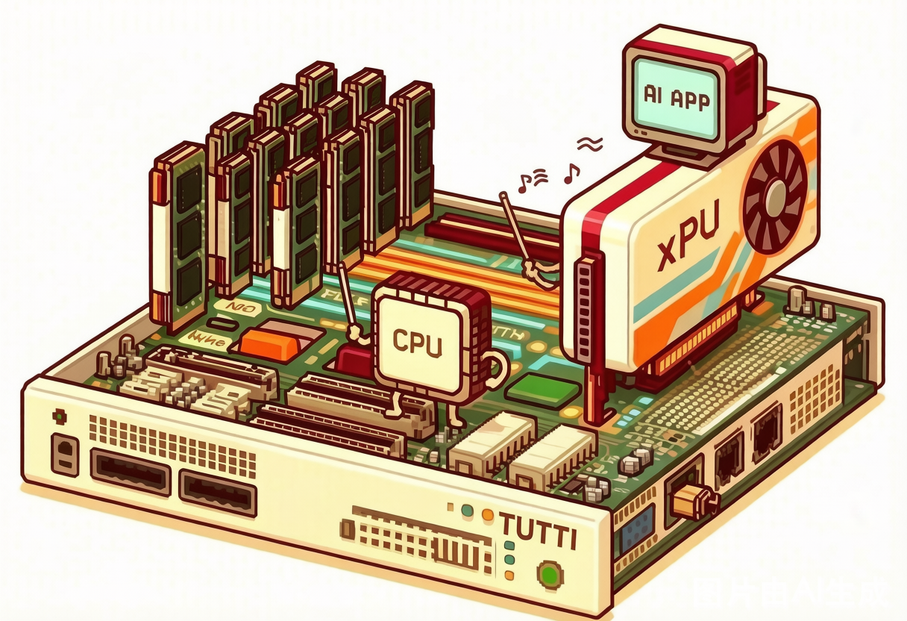

# Tutti

**A GPU-centric, SSD-backed KV cache object store for long-context LLM serving.**

Tutti (Italian for "all instruments together") makes NVMe SSDs a practical KV-cache tier for LLM inference, building on the ideas of [GeminiFS](https://www.usenix.org/conference/fast25/presentation/qiu) (FAST'25), a companion file system for GPUs. **The CPU launches I/O kernels; the GPU executes them.** Each GPU kernel moves KV cache between SSDs and HBM on its own — giving SSD-backed KV cache DRAM-like performance with hundreds of times the capacity.

## 📰 News


- **2026.7** — `snvme` kernel module update: dynamic CPU-side and GPU-side queue allocation after mount, a standard POSIX interface, and poll-based I/O submission from both user-space threads and GPU kernel threads. GPU memory registration now goes through the Phoenix P2P service, so `snvme` coexists with Phoenix.

- **2026.6** — Tutti adapted to the MetaX C600 GPU.

- **2026.5** — Tutti paper released on [arXiv](https://arxiv.org/abs/2605.03375) (SSD-backed KV cache: −78.3% TTFT, 2× request rate, −27% serving cost vs. GDS-enabled LMCache).

## ✨ Product Highlights

- **GPU io_uring** — one kernel launch drives thousands of NVMe I/Os: each GPU thread resolves LBAs, writes SQEs, rings doorbells, and polls completions on its own. No CPU on the data path.
- **Register once, then just look up** — PRP descriptors are pre-built at registration; one DMA mapping serves every NVMe controller. The I/O hot path is table lookup, not arithmetic.
- **Millions of files within GPU reach** — ~200-byte GPU-resident file handles plus two-tier (GPU L1 / pinned-host L2) caching; FIEMAP is walked exactly once per file.
- **Multi-device striping** — a `GpuFile` spans up to 4 NVMe SSDs in tensor-sized units, shard-picked on-GPU in the same kernel.
- **Beyond NVIDIA** — MetaX C600 GPU adapted (2026.6); ROCm / SYCL / CANN on the HAL roadmap.

## What is Tutti

Modern LLM engines (vLLM, SGLang) page the KV cache into small, scattered GPU memory blocks. Once that cache is offloaded to SSDs, memory fragmentation becomes **I/O fragmentation**: restoring a long prefix means issuing hundreds of thousands of tiny random I/Os — and in a CPU-centric design, every single one is initiated by the CPU. The result is massive GPU stalls: reusing KV cache from SSD ends up slower than recomputing it, and the penalty only grows as GPU compute keeps getting faster.

The conductor doesn't play the instruments: the CPU only cues the orchestra (launches I/O kernels); the GPU musicians read their own descriptors and drive the NVMe drives directly:

<p align="center">
  
</p>

Tutti's answer is a GPU-centric data path where the CPU appears only **O(1) times per batch, not per I/O**. Five key designs make this work — GPU io_uring, register-time precomputation, LMCache-scale two-tier metadata caches, a batched and event-frugal control plane, and multi-device striping — detailed in [doc/architecture/key-designs.md](doc/architecture/key-designs.md).

## System Architecture

```text
┌───────────────────────────────────────────────────────────────┐
│  Application                                                    │
│    thinks in: index / offset / size (persistent)                │
└───────────────────────────────────────────────────────────────┘
        │ open a target, register a buffer, submit a batch
        ▼
╔═══════════════════════════ coordinator ═══════════════════════════╗
║                                                                   ║
║  ┌──────────────────────────┐        ┌──────────────────────────┐ ║
║  │  Block Storage (GPUFile) │        │  raw device              │ ║
║  │  named, striped, persist │        │  namespace + LBA range   │ ║
║  └────────────┬─────────────┘        └────────────┬─────────────┘ ║
║               │        produce StorageTarget       │              ║
║               └──────────────────┬──────────────────┘             ║
║                                  ▼                                 ║
║                       ┌─────────────────────────────┐             ║
║                       │         IO Engine           │             ║
║                       │  unified transfer schemes:  │             ║
║                       │  batch GPU-stream / CPU sync│             ║
║                       │  / async / COOP             │             ║
║                       └──────────────┬──────────────┘             ║
║                     submit work +    │  (build PRP/SGL via SPI)    ║
║                     descriptor build ▼                             ║
║               ┌──────────────────────────────────────────────┐    ║
║               │                 Backends                      │    ║
║               │  thin transport adapters (SPI: IBackendProvider)│   ║
║               │  ┌────────────────┐  ┌───────┐  ┌───────┐    │    ║
║               │  │ local_nvme     │  │  gds  │  │ rdma  │    │    ║
║               │  │ file / raw     │  │cuFile │  │  QP   │    │    ║
║               │  │ PRP build+cache│  └───────┘  └───────┘    │    ║
║               │  │ resolve_lba,   │                          │    ║
║               │  │ target handle, │   pull vDevice (queues)  │    ║
║               │  │ launch kernel  │───────────────┐          │    ║
║               │  └────────────────┘               │          │    ║
║               └───────────────┬───────────────────┼──────────┘    ║
║          NVMe backends only ↓ │                   │ all backends  ║
║        ┌──────────────────────▼──────────┐        │               ║
║        │     Device Manager              │        │               ║
║        │  local-NVMe virtualization base │        │               ║
║        │  • controller bring-up (drivers:│        │               ║
║        │    direct / service-client)     │        │               ║
║        │  • queue-pair budget + 2-level  │        │               ║
║        │    allocation (cross-process)   │        │               ║
║        │  • hands out vDevice = queue    │        │               ║
║        │    slice + ns view + caps       │        │               ║
║        │  • device-side queue mechanics  │        │               ║
║        │    (QueuePair contract, poll,   │        │               ║
║        │     acquire_queue, issue_cmd)   │        │               ║
║        └───────────────┬─────────────────┘        │               ║
║                        │ cudaMalloc d_qps,        │               ║
║                        │ map doorbell (via HAL)   │               ║
║                        ▼                          ▼               ║
║               ┌──────────────────────────────────────────────┐    ║
║               │            Accelerator HAL                    │    ║
║               │  ┌──────────┐   ┌──────────┐                 │    ║
║               │  │  launch  │   │  memory  │  dma_map, stream,│    ║
║               │  └──────────┘   └──────────┘  event, memcpy,  │    ║
║               │  MemoryRegion registry; generic atomics       │    ║
║               └───────────────────────┬──────────────────────┘    ║
║                                        ▼                           ║
║               ┌──────────────────────────────────────────────┐    ║
║               │              Abstraction                       │    ║
║               │  TUTTI_DEVICE / GLOBAL / FORCEINLINE /         │    ║
║               │  ATOMIC / LAUNCH_KERNEL  → per-vendor mapping  │    ║
║               │  (CUDA / ROCm / SYCL / CANN)                   │    ║
║               └──────────────────────────────────────────────┘    ║
╚═══════════════════════════════════════════════════════════════════╝
```


**Environment (tested)**

- OS: Linux, kernel 5.15.x (`snvme-5.15.0-public` baseline); a 5.4.241 (tlinux4) module lineage is also maintained
- Accelerator: NVIDIA GPU + CUDA toolkit (`nvcc`); bare metal with IOMMU in passthrough mode
- Host deps: CMake, protobuf / gRPC / uuid / yaml-cpp — one-shot setup via `scripts/prepare_env.sh`


## Roadmap

Coming soon — see the [full roadmap](Roadmap.md) for details.

## Deep Dive

- [Key Designs](doc/architecture/key-designs.md) — the five performance designs behind the GPU-centric data path, with code pointers
- [System Architecture](doc/architecture/system-architecture.md) — the as-implemented layered architecture, layer by layer
- [Build & SNVMe Testing](doc/build_and_test.md) — environment setup, build, module install, and the smoke-test ladder
- [Backend SPI](doc/design/backend-spi.md) — the `IBackendProvider` contract for pluggable transports
- [GPU Abstraction](doc/design/gpu-abstraction.md) — the path from CUDA-only to a vendor-neutral HAL
- [Kernel Portability](doc/design/kernel-portability.md) — the snvme kernel module across Linux versions
- [Storage Extensibility](doc/design/storage-extensibility.md) — composing namespaces with data-path backends
- [Restructuring Plan](doc/refactor/restructuring-plan.md) — how the monolith is being split into layers
- [Roadmap](Roadmap.md) — the active v0.1 baseline and phases
- [Contributing](CONTRIBUTING.md) — install, test, and contribution rules

## Cite

If you use Tutti in your research, please cite our paper — and the GeminiFS work it builds on:

```bibtex
@article{tutti,
  title   = {Tutti: Making SSD-Backed KV Cache Practical for Long-Context LLM Serving},
  author  = {Qiu, Shi and Hu, Yifan and Wang, Xintao and Zhu, Wenhao and Yan, Jianqin and Chen, Hao and Xu, Kaiqiang and Chen, Kai and Zhang, Yiming},
  journal = {arXiv preprint arXiv:2605.03375},
  year    = {2026}
}

@inproceedings{geminifs,
  author    = {Shi Qiu and Weinan Liu and Yifan Hu and Jianqin Yan and Zhirong Shen and Xin Yao and Renhai Chen and Gong Zhang and Yiming Zhang},
  title     = {{GeminiFS}: A Companion File System for {GPUs}},
  booktitle = {23rd USENIX Conference on File and Storage Technologies (FAST 25)},
  year      = {2025},
  isbn      = {978-1-939133-45-8},
  address   = {Santa Clara, CA},
  pages     = {221--236},
  publisher = {USENIX Association},
  month     = feb
}
```

## Contact & community

*Contact information to be added (maintainers / mailing list / Slack or WeChat group).* For bug reports, please use the issue template — see [CONTRIBUTING.md](CONTRIBUTING.md).

Questions, adaptation proposals, or interest in becoming a community maintainer / manager — reach out to Shi Qiu at ryeqiu@tencent.com.


## License

Apache-2.0 — see [LICENSE](LICENSE).
